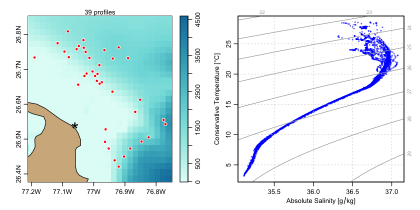

# argoFloats

This R package provides tools for downloading and analyzing collections of
oceanographic Argo float datasets.

The code and graph below show an example of the construction of a
temperature-salinity diagram inferred from the 63 float profiles that were
within 160km of Sable Island, according to the Argo repository accessed in late
February of 2020.
```R
library(argoFloats)
library(oce)
# TS diagram for profiles near Abaco Island, Bahamas.
indexAll <- getIndex(destdir="~/data/argo")
index <- subset(indexAll,
                circle=list(longitude=-77.06,latitude=26.54,radius=30))
profileIndex <- getProfiles(index)
argos <- readProfiles(profileIndex)
first <- TRUE
# Semi-transparent colours hint at sample repeatability
col <- rgb(0, 0, 1, 0.4)
for (i in seq_len(argos[["profile count"]])) {
    argo <- handleFlags(argos[["profile", i]])
    # Skip profiles which lack no valid salinities
    ok <- sum(is.finite((argo[["salinity"]])))
    if (ok > 0) {
        if (first) {
            plotTS(argo, Slim=c(35, 37), Tlim=c(3, 30), eos="gsw",
                   cex=0.5, col=col, pch=20)
            first <- FALSE
        } else {
            points(argo[["SA"]], argo[["CT"]],
                   cex=0.5, col=col, pch=20)
        }
    }
}
```


