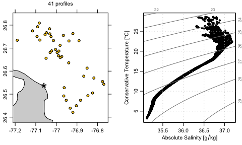

<!-- README.md is generated from README.Rmd. Please edit that file -->

# argoFloats

<!-- badges: start -->

<!-- badges: end -->

The argoFloats package for the R language provides tools for downloading
and analyzing collections of oceanographic Argo float datasets. Its
developers are \* Dan Kelley, Dalhousie University \* Jaimie Harbin,
Bedford Institute of Oceanography and Dalhousie University \* Clark
Richards, Bedford Institute of Oceanography \* Dewey Dunnington, Bedford
Institute of Oceanography

The CRAN version may be installed with

    install.packages("argoFloats")

The development version may be installed with

    library(devtools)
    install_github("ArgoCanada/argoFloats", ref="develop")

where, of course, the `devtools` package must be installed first, if it
is not already present on the user’s system.

Once things are set up as above, it will be possible to use all the
features of `argoFloats`, many of which are illustrated in the
documentation for its functions, and in the vignette that is built into
the package, both of which are displayed on the [user-oriented
website](https://argocanada.github.io/argoFloats/index.html). Note that
the vignette also lists Youtube videos about the package.

As a practical example, the code block given below shows how to create a
map and a temperature-salinity diagram for Argo float profiles near
Abaco Island in the Bahamas. The key steps, many of which are common to
most analyzes using the package, are as follows.

1.  The `getIndex` function is used to download a worldwide index of
    float profiles. (Use `?getIndex` to learn more about this function,
    and note in particular the `destdir` argument, which determines
    where the index and other argo files will be stored locally.)

2.  The `subset` function is used to narrow the region of interest,
    yielding 39 profiles as of mid-June, 2020.

3.  `getProfiles` is used to download the NetCDF files that contain the
    profile measurements.

4.  `readProfiles` is used to read those files.

5.  `applyQC` is used to set questionable data to `NA`. This uses
    quality-control (QC) flags that are present in the argo data.

6.  `plot` is used to create a map plot. The image shows water depth in
    metres, determined through a call to the `getNOAA.bathy` function in
    the `marmap` package. For context, a star is drawn to indicate the
    centre of he focus region. A label is drawn above the map, showing
    the number of profiles. This illustrates the use of `[[`, a generic
    R function that is used in argoFloats to access data and metadata
    elements in argoFloats objects, as well as things that can be
    computed from these elements, such as seawater density, etc. Use
    `?"[[,argoFloats-method"` to see the details of how `[[` works.

7.  `plot` is used again, to make a temperature-salinity diagram.

With this in mind, readers ought to find it easy to read the following
code. A reasonable next step would be to try altering the code, perhaps
to explore another region or to see whether the QC step is actually
necessary.

    library(argoFloats)
    library(oce)
    #> Loading required package: gsw
    ## 1. Get worldwide float-profile index, saving to ~/data/argo by default.
    indexAll <- getIndex()
    ## 2. Narrow to a 30km-radius circle centred on Abaco Island, The Bahamas.
    index <- subset(indexAll,
                    circle=list(longitude=-77.06,latitude=26.54,radius=30))
    #> Kept 41 cycles (0.00162%)
    ## 3. Get NetCDF files for these profiles, saving to ~/data/argo by default.
    profiles  <- getProfiles(index)
    ## 4. Read the NetCDF files.
    argos <- readProfiles(profiles)
    #> Warning in readProfiles(profiles): Of 41 profiles read, 2 have >10% of conductivity values with QC flag of 4, signalling bad data.
    #>     The indices of the bad profiles are as follows.
    #>     3 8
    #> Warning in readProfiles(profiles): Of 41 profiles read, 1 has >10% of pressure values with QC flag of 4, signalling bad data.
    #>     The indices of the bad profiles are as follows.
    #>     3
    #> Warning in readProfiles(profiles): Of 41 profiles read, 4 have >10% of salinity values with QC flag of 4, signalling bad data.
    #>     The indices of the bad profiles are as follows.
    #>     3 6 7 13
    #> Warning in readProfiles(profiles): Of 41 profiles read, 3 have >10% of temperature values with QC flag of 4, signalling bad data.
    #>     The indices of the bad profiles are as follows.
    #>     3 7 13
    ## 5. Examine QC flags, and set questionable data to NA.
    argosClean <- applyQC(argos)
    oldpar <- par(no.readonly=TRUE)
    par(mfrow=c(1, 2))                     # want two-panel plot
    par(mar=c(3.5, 2.0, 2.0, 2.0))         # maps do not get axis names
    par(mgp=c(2,0.7,0))                    # tighten axes
    ## 6. Plot a map of profile locations.
    plot(index, which="map", bathymetry=FALSE)
    points(-77.06, 26.54, pch="*", cex=3)  # show centre of focus
    mtext(paste(argosClean[["length"]], "profiles"), line=1.0)
    ## 7. Plot a TS diagram
    par(mar=c(3.5, 3.5, 2.0, 1.0))         # increase left margin for name
    plot(argosClean, which="TS")

    par(oldpar)
