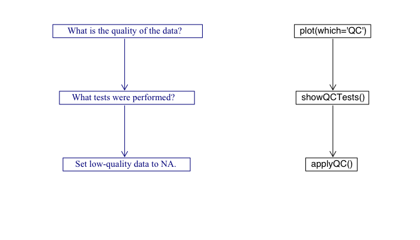
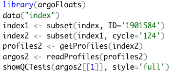
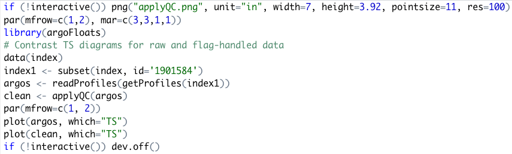

# Tweet 1

Hi Argo community! I want to introduce you to a newly developed R package, argoFloats. This package was created by myself, Dan Kelley, and Jaimie Harbin to provide tools for downloading and analyzing collections of oceanographic Argo float datasets.

# Tweet 2
argoFloats has an easy-to-follow work flow, to allow the users to effectively access, download, and read Argo data. It targets both experienced and new R users.

# Tweet 3
To get familiar with argoFloats, check out the user website, https://argocanada.github.io/argoFloats/index.html, or developer website https://github.com/ArgoCanada/argoFloats for more advanced R users.

# Tweet 4
Users can easily sift through data based on geographical region, parameter, time, institution, deep Argo, id, ocean, mode, and cycle. A series of real-time examples exists at our Youtube channel https://www.youtube.com/channel/UCmVBNwRRGx5sRa1skvfOrvA.

# Tweet 5
For example, the following code demonstrates how to use the easy-to-follow work flow to produces a TS plot near Bermuda:

# Tweet 6
The code below subsets the ocean near the Isthmus of Panama. Note it is a subset by ocean "Area", which is why we incorporated the subset by polygon function.

# Tweet 7
The code shown below demonstrates how to use our subset by polygon and TS plot function to create a T-S diagram comparing the Atlantic and Pacific Ocean near the Isthmus of Panama.

# Tweet 8

In addition, argoFloats users have the ability to create a TS diagram, colour-coded by oxygen using the following code:

# Tweet 9
Bathymetry has recently been added to the argoFloats package. A great example of this is shown by this trajectory plot colour coded by time, with bathymetry in the Labrador Sea.

# Tweet 10
What about Quality Control (QC), you say? argoFloats has incorporated a simple work flow to assess Argo float flags.

# Tweet 11
By using the following code, the user has the ability to plot a QC plot that color codes the "bad" data in red, and "good" data in black.

# Tweet 12
In the previous example, the first cycle is considered "bad". To determine which QC Tests were performed on that cycle the following code is used to produce the following output:

#Tweet 13
If the user agrees with the test failed, they can replace all suspicious data with NA. An example where this may be useful is dealing with BGC-Argo data such as oxygen. For example, the following code shows the shows the need for QC testing in our previous example.

# Tweet 15
FIX ME!!!! ADD USEADJUSTED DIADRAM IN
# Tweet 16
Some data sets undergo adjustments that are made in recognition of the QC analysis or to employ information about improved calibrations, etc. For this reason the useAdjusted function was created. An example is shown below.

