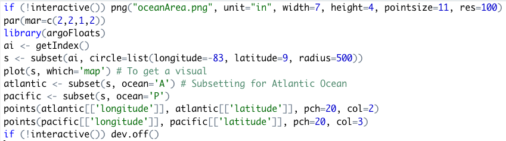
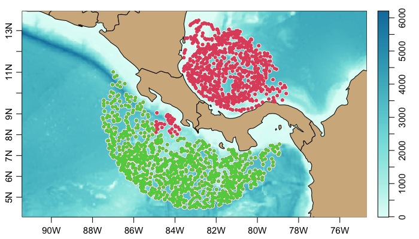
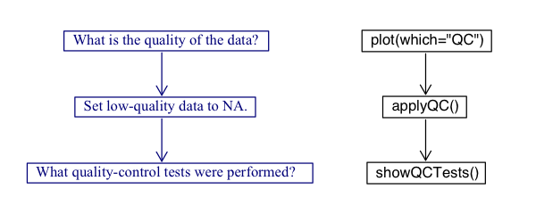

# Tweet 1

Hi Argo community! I want to introduce you to a newly developed R package, argoFloats. This package was created by myself, Dan Kelley, and Jaimie Harbin to provide tools for downloading and analyzing collections of oceanographic Argo float datasets.

# Tweet 2
argoFloats has an easy-to-follow work flow, to allow the users to effectively
access, download, and read Argo data. It targets both experienced and new R
users.

# Tweet 3
To get familiar with argoFloats, check out the user website, https://argocanada.github.io/argoFloats/index.html, or developer website https://github.com/ArgoCanada/argoFloats for more advanced R users.

# Tweet 4
Users can easily sift through data based on geographical region, parameter, time, institution, deep Argo, id, ocean, mode, and cycle. A series of real-time examples exists at our Youtube channel https://www.youtube.com/channel/UCmVBNwRRGx5sRa1skvfOrvA.

# Tweet 5
For example, the following code demonstrates how to use the easy-to-follow work flow to produces a TS plot near Bermuda:

# Tweet 6
To subset by ocean "Area", the following code is used. Note: we'e also incorporated a subset by polygon to better improve this subset.

# Tweet 7
The code shown below demonstrates how to use our subset by polygon and TS plot function to create a TS diagram comparing the Atlantic and Pacific Ocean near the Isthmus of Panama.

# Tweet 8

In addition, argoFloats users have the ability to create a TS diagram, colour-coded by oxygen using the following code:

# Tweet 9
Bathymetry has recently been added to the argoFloats package. A great example of this is shown by this trajectory plot colour coded by time, with bathymetry in the Labrador Sea.

# Tweet 10
What about Quality Control (QC), you say? argoFloats has incorporated a simple work flow to work with Argo float QC flags.

# Tweet 11
The first phase when dealing with QC for Argo data is to plot the quality of the data using the QC plot. This is shown in the code below where each point is a cycle representing "bad" data in red, and "good" data in black.

# Tweet 12
In the QC plot, the first cycle is considered "bad". To determine which QC Tests were performed on that cycle the following code is used to produce the following output:

#Tweet 13

If the user agrees with the test failed, they can replace all suspicious data with NA. For example, the following code shows the need for QC testing in our previous example.

# Tweet 15
In addition to flags, some data sets undergo adjustments that are made in
recognition of the QC analysis or to employ information about improved
calibrations, etc. For this reason the useAdjusted function was created.

# Tweet 16
useAdjusted can be a fairly complicated process. However, the diagram below
demonstrates the actions taken when a user specifies `which=ALL` or
`which=<param>`.

# Tweet 17
An example where useAdjusted is useful is when dealing with oxygen data. Often
times, BGC data need calibration due to sensors and that can be represented in
the data, as shown below.

