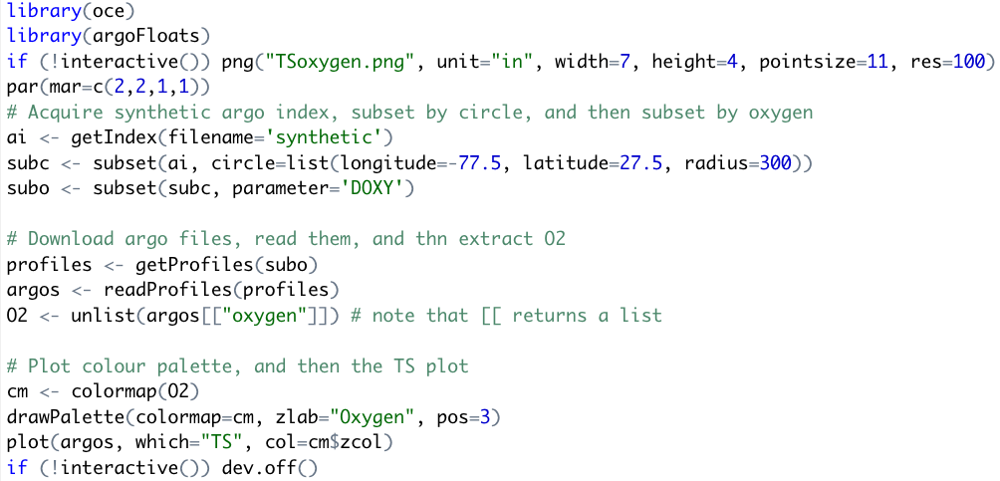
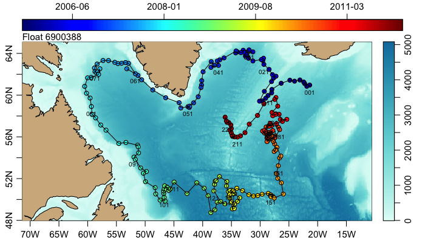
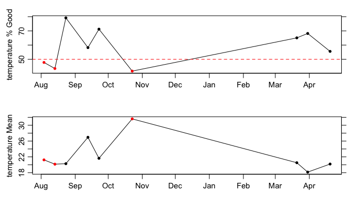

# Tweet 1

Hi Argo community! I want to introduce you to a newly developed R package, argoFloats. This package was created by myself, Dan Kelley, and Jaimie Harbin to provide tools for downloading and analyzing collections of oceanographic Argo float datasets.

# Tweet 2
argoFloats has an easy-to-follow work flow, to allow users to effectively access, download, and read Argo data. It targets both experienced and new R users.

# Tweet 3
argoFloats is on CRAN! To get familiar with argoFloats, check out the user website (https://argocanada.github.io/argoFloats/index.html) or the developer website (https://github.com/ArgoCanada/argoFloats) for more advanced R users.

# Tweet 4
Users can easily sift through data based on geographical region, parameter, time, institution, deep Argo, ID, ocean, mode, cycle, direction, column, or dataStateIndicator. A series of real-time examples exists at our Youtube channel https://www.youtube.com/channel/UCmVBNwRRGx5sRa1skvfOrvA.

# Tweet 5
For example, the following code demonstrates the workflow to produce a TS plot near Bermuda.

# Tweet 6
To subset by ocean "Area", the following code is used. Note: regarding those spurious red dots in the Pacific, we also provide a method to subset by polygon.

# Tweet 7
The code shown below demonstrates how to subset by polygon to study watermass contrasts between the Atlantic and Pacific oceans across the Isthmus of Panama.

# Tweet 8

In addition, argoFloats users have the ability to create a TS diagram, colour-coding for oxygen, as follows.

# Tweet 9
Bathymetry can be shown on argoFloats map plots. A good example of this is shown in a trajectory plot for a float in the Labrador Sea, colour-coded for time.

# Tweet 10
What about Quality Control (QC), you say? argoFloats offers an easy workflow for handling Argo QC flags.

# Tweet 11
The dataStateIndicator reveals the degree of processing the Argo data has gone through. Using the following code, the user has the ability to select a specific degree of processing data in the Arabian Sea, for example.

# Tweet 12
For further QC analysis of Argo data, the first step is to plot the quality of the data using the QC plot. This is shown below, where each point is a cycle representing "bad" data in red, and "good" data in black.

# Tweet 13
In the QC plot, the first cycle is considered "bad". Here's how to determine which QC Tests were performed on that cycle:

# Tweet 14

If you agree with the test failed, you can replace all suspicious data with NA. For example, the following shows the need for QC testing in our previous example ... but there are still some stray points!

# Tweet 15
In addition to flags, some datasets undergo adjustments that are made in recognition of the QC analysis or to employ information about improved calibrations, etc. We'll get into that in the next tweet.

# Tweet 16
useAdjusted can be a fairly complicated process; the following diagram demonstrates the actions taken when a user specifies `which=ALL` or `which=<param>`.

# Tweet 17
The useAdjusted function is handy when dealing with oxygen data, which may be adjusted due to sensor recalibration, etc.

# Tweet 18
Lastly, typing mapApp() opens a interactive app to analyze specific regions, floats, time, etc.

