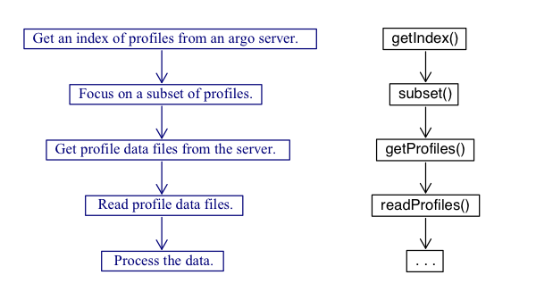
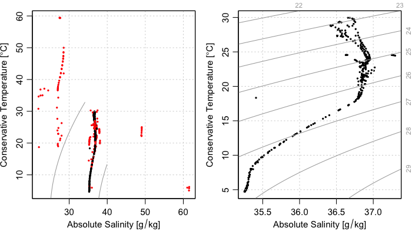

# Tweet One

Hi Argo community! I want to introduce you to a newly developed R package, argoFloats. This package was created by myself, Dan Kelley, and Jaimie Harbin to provide tools for downloading and analyzing collections of oceanographic Argo float datasets.

# Tweet Two
argoFloats has an easy-to-follow work flow, to allow the users to effectively access, download, and read Argo data.

# Tweet Three
To get familiar with argoFloats, check out the user website, https://argocanada.github.io/argoFloats/index.html, or developer website https://github.com/ArgoCanada/argoFloats for more advanced R users.

# Tweet Four
Users can easily sift through data based on geographical region, parameter, time, institution, deep Argo, id, ocean, mode, and cycle. A series of real-time examples exists at our Youtube channel https://www.youtube.com/channel/UCmVBNwRRGx5sRa1skvfOrvA.

# Tweet Five
For example, the following code demonstrates how to use the easy-to-follow work flow to produces a TS plot near Bermuda:

# Tweet Six
The following link provides code for subsetting by ocean near the Isthmus of Panama. Note it is a subset by ocean "Area", which is why we incorporated the subset by polygon function.
https://github.com/ArgoCanada/argoFloats/tree/develop/videos/04

# Tweet 07
Code found at https://github.com/ArgoCanada/argoFloats/blob/develop/sandbox/jlh/08_polygonPlot/polygonPlot.R demonstrates how to use our subset by polygon and TS plot function to create a T-S diagram comparing the Atlantic and Pacific Ocean near the Isthmus of Panama.

# Tweet 07
The code found at https://github.com/ArgoCanada/argoFloats/blob/develop/videos/05/video05_TS_by_oxygen.R demonstrates how to use the argoFloats package to create a TS diagram, colour-coded by oxygen.

# Tweet 08
Bathymetry has recently been added to the argoFloats package. If you visit https://github.com/ArgoCanada/argoFloats/blob/develop/videos/07/video07_map_with_bathymetry.R you can find code to create a trajectory plot, colour coded by time, with bathymetry.

# Tweet 9
What about Quality Control (QC), you say? argoFloats has incorporated a simple work flow to assess Argo float flags.

# Tweet 10
By using the following code, the user has the ability to plot a QC plot that color codes the "bad" data in red, and "good" data in black.

# Tweet 11
In the previous example, the first cycle is considered "bad". To determine which QC Tests were performed on that cycle the following code is used to produce the following output:

#Tweet 12
If the user agrees with the test failed, they can replace all suspicious data with NA. An example where this may be useful is dealing with BGC-Argo data such as oxygen. For example, the following code shows the shows the need for QC testing in our previous example.

# Tweet 13
Some data sets undergo adjustments that are made in recognition of the QC analysis or to employ information about improved calibrations, etc. For this reason the useAdjusted function was created. An example is shown below.

