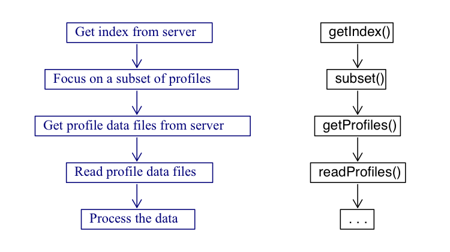
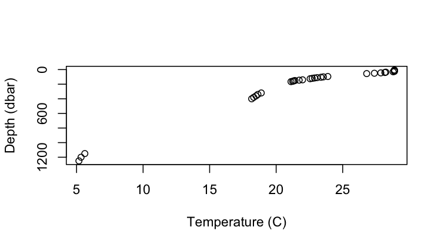

```{=html}
<!-- HOW TO BUILD AND VIEW THE VIGNETTES.
1. Edit this file in vignettes/argoFloats.Rmd
2. Do not bother trying to build vignettes in RStudio. Instead,
   in a unix shell, type the following:
       R CMD build --compact-vignettes="qpdf" argoFloats
       R CMD install argoFloats_0.1.2.tar.gz
   where the version number may need adjustment in the second command.
3. To see the results, type the following in an R console:
      browseVignettes("argoFloats")
-->
```
```{r, echo=FALSE}
knitr::opts_chunk$set(collapse=TRUE, comment="#>")
```

**Abstract.** The `argoFloats` package makes it easy identify, download,cache, and analyze oceanographic data collected by Argo profiling floats, while handling quality control. Our goal in making this package was to eliminate the gap between the freely available Argo data and the end user.

# Introduction

The `argoFloats` package provides tools for downloading and processing Argo profile data. It allows users to focus on core, biogeochemical ("BGC") , or deep Argo profiles, and also allows the user to sift these profiles based on ID, time, geography, variable, institution, ocean, cycle, direction, profile, dataStateIndicator, etc. Once downloaded, such data sets can be analyzed within `argoFloats` or using other R tools and packages.

# Youtube Videos

As an adjunct to the written documentation, the following videos are provided, to introduce concepts and show how to accomplish some every-day tasks. In some cases, sample code is also made available at <https://github.com/ArgoCanada/argoFloats/tree/develop/videos>.

| Video Name                                             | Creators                   | Date         | URL                            |
|--------------------------------------------------------|----------------------------|--------------|--------------------------------|
| argoFloats R 01: Introduction                          | Dan Kelley & Jaimie Harbin | Apr  9, 2020 | `https://youtu.be/xeBoFbb66Nk` |
| argoFloats R 02: TS plot near Bermuda                  | Jaimie Harbin & Dan Kelley | Apr 24, 2020 | `https://youtu.be/ZoTrVEMG5Qo` |
| argoFloats R 03: New website                           | Jaimie Harbin & Dan Kelley | Apr 30, 2020 | `https://youtu.be/lOvCrRDTmTs` |
| argoFloats R 04: Subset by ocean or polygon            | Jaimie Harbin & Dan Kelley | May  7, 2020 | `https://youtu.be/tcGRB479Udk` |
| argoFloats R 05: TS diagram, colour-coded by oxygen    | Jaimie Harbin & Dan Kelley | May 14, 2020 | `https://youtu.be/Y_SxjcOnW04` |
| argoFloats R 06: Trajectory plot, colour coded by time | Jaimie Harbin & Dan Kelley | May 28, 2020 | `https://youtu.be/7BB3UuwjUqo` |
| argoFloats R 07: Maps with bathymetry                  | Jaimie Harbin & Dan Kelley | Jun  4, 2020 | `https://youtu.be/Lc32MTMCbbI` |
| argoFloats R 08: Introduction to quality control flags | Jaimie Harbin & Dan Kelley | Aug 12, 2020 | `https://youtu.be/nN4xs0wCnB4` |
| argoFloats R 09: Advanced Quality Control              | Dan Kelley & Jaimie Harbin | Aug 27, 2020 | `https://youtu.be/dYzEO5S2GBw` |
| argoFloats R 10: Using adjusted data streams           | Dan Kelley & Jaimie Harbin | Sep  3, 2020 | `https://youtu.be/AuauWeUnopc` |
| argoFloats R 11: mapApp()                              | Dan Kelley & Jaimie Harbin | Sep 21, 2020 | `https://youtu.be/PEkIBwXLLpE` |
| argoFloats R 12: dataStateIndicator()                  | Dan Kelley & Jaimie Harbin | Nov 13, 2020 | `https://youtu.be/RhLmT5S_XzU` |


# Preliminary Setup

Since argoFloats is in an active phase of development, it is not yet available on CRAN. Still, it is easily installed in R with

```{r, eval=FALSE}
library(devtools)
install_github("ArgoCanada/argoFloats", ref="develop")
```
`
where, of course, the devtools package must be installed first, if it is not already present on the user's system.

# Work Flow

Figure 1 illustrates the typical workflow with the package, with descriptions of the steps on the left, and names of the relevant functions on the right.



As shown above, the central functions for the `argoFloats` package are `getIndex()`, `subset()`, `getProfiles()`, and `readProfiles()`.

Some built-in data sets are provided for concreteness of illustration and for testing, but actual work always starts with a call to `getIndex()` to download a full index of float data, which we will demonstrate later in this vignette.

To begin to get familiar with how the `argoFloats` package works, we will begin looking at the built in data sets. Built into the `argoFloats` package is the `index`, `indexBgc`, `indexSynthetic`, and `indexDeep` indices, referring to core Argo, BGC-Argo, a combination, and deep Argo respectively. It should be noted that as of September 21, 2020, `indexMerged` no longer exists as the switch to `indexSynthetic` has been made. For the sake of this vignette we will focus on the `index` data set.

The first step is to access the required packages that will be needed during this tutorial, with

```{r message=FALSE, warning=FALSE}
library(oce)
library(ocedata)
library(argoFloats)
```

To access the embedded index within `argoFloats`, the following code is used:

```{r}
data("index")
```

It is now possible to process the downloaded index using the `argoFloats` specialized versions of R "generic" functions, `plot()`, `[[`, `summary()`, and `show()` as shown below.

# Processing Steps

The following subsections use built-in data.

## Plotting

The specialized `plot()` command within the `argoFloats` package provides simple ways to plot aspects of `argoFloats-class` objects. To produce the built in plot and visualize the coordinates of a section of Argo floats off of the Bahamas, the following code is used:

```{r, fig.cap="Figure 2: Built in index demonstrating Argo profiling floats within 200 km of Bahamas."}
plot(index, bathymetry=FALSE)          # also, try using bathymetry=TRUE
```

## Extracting Data

Furthermore, the `[[` command provides a way to extract items from `argoFloats` objects, without getting lost in the details of storage. For example, if the user wanted to extract the `file` within the `index` data set, instead of doing `index@data$index$file`, instead they can simply do `index[["file"]]`. (Note that `[[<-` is *not* specialized, since the user is highly discouraged from altering values within `argoFloats` objects).

## Summarizing

Additionally, the `summary()` command displays key features of `argoFloats-class` objects such as the type, server, file, URL etc. See `summary,argoFloats-method()` further details.

## Printing

Lastly, the `show()` command provides a one-line sketch of `argoFloats-class` objects. This gets used by the `print()` function. For example if the user types in:

```{r, eval=FALSE}
index
```

The following output occurs:

    argoFloats object of type "index" with 953 items

**Hint:** This command can be particularly useful when doing the `merge()` command, which will be explained in greater detail further down.

It should be noted that the profile elements within `argoFloats` objects are stored as in the form of `argo` objects as defined by the `oce` package. This means that `argoFloats` users can rely on a wide variety of `oce` functions to analyze their data. The full suite of R tools is also available, and the vastness of that suite explains why `argoFloats` is written in R.

# Function Details

## getIndex()

Until this point, we have demonstrated how the user can become familiar with embedded indices. As previously described, however, actual work always starts with downloading a full index of float data. As shown by Figure 1, the `getIndex()` command is used to get an index of available Argo float profiles, either by downloading information from a data repository or by reusing an index (stored as an .rda file) that was prepared by a recent call to the function.

The `getIndex()` command works by specifying the server, with first trying the Ifremer server \url{ftp://ftp.ifremer.fr/ifremer/argo} and then the USGODAE server \url{ftp://usgodae.org/pub/outgoing/argo} if that does not work. The next step is to specify the file name. The table below can be obtained using `?getIndex()`. As shown, the user has the ability to write the specific file name from the server, or to simply use the embedded nicknames within the package: `"core"`, `"bgc"` or `"bgcargo"`, or `"synthetic"`. The following table summarizes the contents of the various files indicated by the `filename` argument.

| File Name                             | Nickname               | Contents                               |
|---------------------------------------|------------------------|----------------------------------------|
| `ar_greylist.txt`                     | \-                     | Suspicious/malfunctioning floats       |
| `ar_index_global_meta.txt.gz`         | \-                     | Metadata files                         |
| `ar_index_global_prof.txt.gz`         | `"core"`               | Argo data                              |
| `ar_index_global_tech.txt.gz`         | \-                     | Technical files                        |
| `ar_index_global_traj.txt.gz`         | \-                     | Trajectory files                       |
| `argo_bio-profile_index.txt.gz`       | `"bgc"` or `"bgcargo"` | Biogeochemical data (without S or T)   |
| `argo_bio-traj_index.txt.gz`          | \-                     | Biogeochemical trajectory files        |
| `argo_synthetic-profile_index.txt.gz` | `"synthetic"`          | Synthetic data, successor to `"merge"` |

Additionally, the `destdir` argument has a default of `~/data/argo`, where it should be noted that `~` is a short cut for `C:\Users\`. See `?getIndex()` for further description about the additional arguments for this command.

To get the index from the Ifremer server, the following code is used:

```{r eval=FALSE}
ai <- getIndex("core")
```

```{r echo=FALSE}
data(index)
ai <- index
```

## subset()

As shown by Figure 1, the next step when working with the `argoFloats` package is to use the `subset()` function to focus on a subset of profiles. The `argoFloats` package provides tools to sift through profiles based on ID, time, geography, variable, institution, ocean, dataMode, cycle, direction, profile, dataStateIndicator, section, etc.

For geographic subsetting, the user has the ability to subset by `circle`, `rectangle`, `polygon`, or `section`.

To subset for specific groups of Argo profiling floats off the coast of Bahamas, the following code is used:

```{r, message=FALSE, fig.cap="Figure 3: 50 km radius and polygon subset of Argo profiling floats found off the coast of Bahamas", warning=FALSE}
# Subsetting by circle
aiCircle <- subset(ai, circle=list(longitude=-77.5, latitude=27.5, radius=50))
# Subsetting by polygon
lonPoly <- c(-76.5, -76.0, -75.5)
latPoly <- c(25.5, 26.5, 25.5)
aiPoly <- subset(ai, polygon=list(longitude=lonPoly, latitude=latPoly))
# Plotting the subsets together
CP <- merge(aiCircle, aiPoly)
plot(CP, bathymetry=FALSE)             # also, try using bathymetry=TRUE
```

**Exercise 1:** Use the subset by rectangle function to add a rectangle subset onto Figure 3 and subset all of the data to only include samples between 2012 and 2020.

As of March, 2021, a subset by `section` was developed to create a section of Argo data, similarly to what is done with CTD data. A subset by `section` combined with subset by `time` can provide insightful information of Argo vs CTD sampling efforts. An example of this is highlighted below, which compares a section of Argo data from the Mediterranean outflow region across to North America to the line A03 CTD section data collected in 1993-09-11. 

**Exercise 2:** Use the information from Figure 4 to compare Argo and CTD section sampling methods.

```{r fig.cap="Figure 4: Comparison of Argo vs. CTD section data in a westward transect from the Mediterranean outflow region across to North Atlantic. Top: Argo data including 49 samples from 2020-09-23 to 2020-10-25 made by the argoFloats package. Bottom: Line A03 section including 124 CTD samples from 1993-09-23 to 1993-10-25 made by oce package", eval=FALSE}
library(oce)
library(argoFloats)
oldpar <- par(no.readonly=TRUE)
par(mfrow=c(2,1))
data(section, package="oce")
#getIndex()
ai <- getIndex()
#subset by section
lonlim <- c(-70, -64,-10)
latlim <-c(40,35,35)
index1 <- subset(ai, section=list(longitude=lonlim, latitude=latlim, width=100))
#subset by time
from <- as.POSIXct("2020-09-23", tz="UTC")
to <- as.POSIXct("2020-10-25", tz="UTC")
index2 <- subset(index1, time=list(from=from, to=to))
plot(index2, bathymetry=FALSE,  asp=1/cos(mean(range(unlist(index2[["latitude"]]), na.rm=TRUE))*pi/180),  mgp=getOption("oceMgp")
)
points(lonlim, latlim, pch=21, col="black", bg="red", type="o")
plot(section, which="map", col="tan")
par(oldpar)
```


## getProfiles()

The next step within the `argoFloats` package is the `getProfiles()` function. This takes an index constructed with `getIndex()`, possibly after focusing with `subset,argoFloats-method()`, and creates a list of files to download from the server named in the index. Then these files are downloaded to the `destdir` directory, using filenames inferred from the source filenames. The value returned by `getProfiles()` is suitable for use by `readProfiles()` function.

## readProfiles()

The `readProfiles()` command works with either a list of local NetCDF files, or a `argoFloats` object type `profiles`, as created by `getProfiles()`.

The command can be useful for analyzing individual profiles, for example:

```{r eval=FALSE}
index1 <- subset(index, 1:2) # To subset for profiles
profiles <- getProfiles(index1)
argos <- readProfiles(profiles)
argosClean <- applyQC(argos)
plot(argosClean, which="profile", type="p")
```



**Exercise 3:** Using the profile in the previous example, plot a TS diagram.

# Solutions to Exercises

**Exercise 1:** Use the subset by rectangle function to add a rectangle subset onto Figure 3 and subset all of the data to only include data between 2012 and 2020.

```{r, eval=FALSE}
library(argoFloats)
ai <- getIndex()
# Subset by circle
index1 <- subset(ai, circle=list(longitude=-77.5, latitude=27.5, radius=50))
# Subset by polygon
lonPoly <- c(-76.5, -76.0, -75.5)
latPoly <- c(25.5, 26.5, 25.5)
index2 <- subset(ai, polygon=list(longitude=lonPoly, latitude=latPoly))
# Subset by rectangle
lonRect <- c(-76.5, -76)
latRect <- c(27, 28)
index3 <- subset(ai, rectangle=list(longitude=lonRect, latitude=latRect))
# Merge the subsets together
index4 <- merge(index1, index2)
index5 <- merge(index3, index4) # Note right now can only merge 2 indices together
# Subset for year 2012-2020
index6 <- subset(index5, time=list(from="2012-01-01", to="2020-01-01"))
# Plot data
plot(index6, bathymetry=FALSE)             # also, try using bathymetry=TRUE
```

**Exercise 2:** Use the information from Figure 4 to compare Argo and CTD section sampling efforts.

Figure 4 reveals that it takes almost 3 months of Argo sampling to reproduce a 1 month CTD section cruise. Additionally, it displayed that there are geographical gaps within the Argo data. On the other hand, it should be noted that by extending the latitude range, these gaps are quickly filled in. In conclusion, Argo sampling is much more cost effective, and it can allow for collection of more information (i.e. nutrients, oxygen, backscattering, etc.) if such thing is desired.

**Exercise 3:** Using the profile in the previous example, plot a TS diagram.

```{r, eval=FALSE}
library(argoFloats)
ai <- getIndex("synthetic")
sub <- subset(ai, 1:2) # To subset for profiles
profiles <- getProfiles(sub)
argos <- readProfiles(profiles)
argosClean <- applyQC(argos)
plot(argosClean, which="TS")
```
