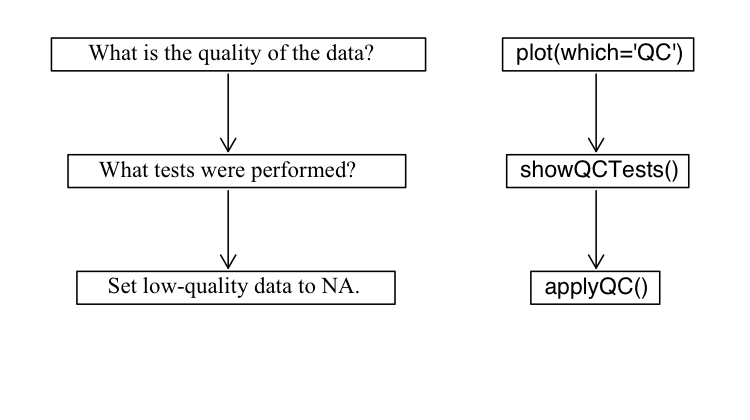

```{r, echo=FALSE}
knitr::opts_chunk$set(collapse=TRUE, comment="#>")
```

**Abstract**
Argo floats data undergo a series of testing procedures to assess the quality.
In addition, some data sets undergo adjustments that are made in recognition of
the Quality Control (QC) analysis or to employ information about improved
calibrations, etc. The creators of `argoFloats` therefore developed ways to
deal with QC flags and adjusted data. For quality control, this centers around
three functions: `plot(which="QC")`, `showQCTests()`and `applyQC()`. Adjusted
data are handled with the `useAdjusted()` function.

<!--

# Developer note

I thought that after rebuilding the package and its vignettes, and installing
the package, using
```{r eval=FALSE}
library(argoFloats)
load_all()
browseVignettes("argoFloats")
```
would show the updated version, but it does NOT. It shows the old version.

-->

# How QC Flags are set

Core, biogeochemical (BGC), and Deep Argo data all undergo testing to ensure the
data found at the Data Assembly Centers are as accurate as possible. This is
done on both "real time" data and "delayed mode" data. As explained in the Argo
User's Manual (Carval et al. 2019), real time measurements are assigned a QC
flag within a 24-48 hour time frame, and delayed mode are looked at by
scientists who apply procedures to check the quality.

# Handling Flags

As described in the Argo user's manual (Carval et al. 2019), data that are given
a flag value of 1, 2, 5, or 8 are considered 'good', those given a
flag value of 9 are missing, and those given flags 3, 4, 6, and 7
are considered 'bad'.

A useful parameter to familiarize with is the `dataStateIndicator`. This tells the user the degree of processing the data has passed through and can be helpful to determine the validity of the data. `argoFloats` has incorporated a way to subset by `dataStateIndicator` to allow the user to analyze data with a specific degree of validity if they wish.

The `argoFloats` package, using the associated `oce` package, has incorporated a 3-step process when
considering argo QC flags. The process encourages users to
always analyze the data they are considering, and acknowledges that the user
assumes all risk from their Argo data, as described in section 1.3 of the Argo
User's Manual (Carval et al. 2019). The process is shown in the
following diagram.



This vignette will walk the users through the three step flag process while
demonstrating examples using the float with `ID` 1901584 near the Bahamas.

## Making QC Plots

`argoFloats` uses the flags within profiles to distinguish between
"good" and "bad" data. It offers a specialized plot type that displays the
quality of data, with a two-panel plot that shows
parameter quality and parameter mean. This only works on objects that
were created by `getProfiles()`.  The user must provide the `parameter` of
interest, but if this is not supplied, the function will issue a message
about the permitted parameters for the dataset.

```{r echo=FALSE}
ID <- "1901584"
```
The following shows how to get the `QC` plot for temperature for the float with
`ID` equal to "`r ID`".

```{r, warning=FALSE, error=FALSE, message=FALSE, eval=FALSE}
library(argoFloats)
data("index")
index1 <- subset(index, ID="1901584")
profiles <- getProfiles(index1)
argos <- readProfiles(profiles)
plot(argos, which="QC", parameter="temperature")
```


As shown, both "good" and "bad" data exist within this
subsection of the data recorded by float `r ID`. For example, the first cycle is marked as
"bad" (since under 50 percent of its data are considered good), as shown by the red dot. If the user had the desire to investigate the QC
performed on this data, the next step would be to use the `showQCTests`
function.


**Exercise 1:** Use the previous code to determine the quality of
temperature data for float `ID` 4900845 referred to in the built-in synthetic index dataset.
Explain your results.

## Discovering which tests were performed

`showQCTests` prints a summary of the QC tests that were performed on an Argo
cycle.  *Caution:* some datasets have flags, indicating that QC procedures had
been performed, even though the metadata contains no indication of such
procedures; this means that `showQCTests` can sometimes suggest that no tests
were done, even though the evidence is that they *had* been done.

`showQCTests` uses `hexToBits()` to decode the hexadecimal values that may
be stored in `historyQCTest`. From there it pairs the determined test values
with the appropriate actions, QC Tests performed or QC Tests failed, found in
`historyAction` within the metadata slot of an individual Argo profile, as read
directly with `oce::read.argo()` or indirectly with `readProfiles()`.

To analyze the first cycle shown by the `plot(..., which="QC")` example, we will
use previously defined variables and the `showQCTests()` function as shown below.

```{r, message=FALSE, error=FALSE, warning=FALSE, eval=FALSE}
index2 <- subset(index1, cycle="124")
profiles2 <- getProfiles(index2)
argos2 <- readProfiles(profiles2)
showQCTests(argos2[[1]])
```

As shown by the output of this function,

```
Tests performed: 2 3 4 5 6 13 14 15 16 17 19
    Failed test 14 (Density Inversion test)
```

Test 14, the Density Inversion Test was failed, given in section 3.11 Reference
table 11: QC test binary IDs of the Argo User's Manual (Carval et al. 2019).

At this step, it is recommended that the user utilizes the Argo Quality Control
Manual for CTD and Trajectory Data (Wong et al. 2020) to determine the criteria
necessary to fail this test, and the action taken if this test is failed. This
will help the user determine if they agree with the results or not. A good way
of doing this is by using the following code to analyze the flags of specific
parameters:

```{r, eval=FALSE}
A <- argos[[1]]
D <- data.frame(T=A[["temperature"]], TF=A[["temperatureFlag"]],
                S=A[["salinity"]], SF=A[["salinityFlag"]],
                P=A[["pressure"]], PF=A[["pressureFlag"]])
```

Note that this particular test is based on potential density, so some further
calculations will be required to check on the procedure.  The procedure is not
simple, and some study of the Argo documentation will be required of any user who
wants to check on the procedures. Even then, a reasonable level of coding
expertise would be required of anyone intending to alter the procedures.
Proceed with caution!

**Exercise 2**: Use the first cycle of Argo float with `ID` 4900845 in the
synthetic dataset to determine which tests were performed and/or failed during
quality control testing. Explain your results.

## Applying QC flags

The `applyQC()` function examines QC within an `argoFloats` object that was
created by `readProfiles()`. By default, it replaces all suspicious data with NA
values, so they will not appear in plots or be considered in calculations. This
is an important early step in processing, because Argo floats
commonly report data that are suspicious based on statistical and physical
measures.

If the user decides they are in agreement with the QC tests performed, and
solely want to work with the data that is considered "good", they can use the
`applyQC` function to rid the "bad" data. An example of where this could be
useful is when looking at TS diagrams as shown below:

```{r, message=FALSE, error=FALSE, warning=FALSE, eval=FALSE}
clean <- applyQC(argos)
oldpar <- par(no.readonly=TRUE)
par(mfrow=c(1, 2))
plot(argos, which="TS")
plot(clean, which="TS")
par(oldpar)
```


Although Figure 3 provides a clear illustration of the need for QC testing and
the handling of QC flags, it also illustrates limitations, for the plot on the
right still contains several data points that are far from the overall data cloud,
and therefore very likely to be erroneous  A good step at this point might be
to find the individual cycles/profiles containing those stray points. This type
of analysis can be found at our Youtube page in video 08
(`https://youtu.be/nN4xs0wCnB4`) and video 09 (`https://youtu.be/dYzEO5S2GBw`).

**Exercise 3** : Use `applyQC()` on float with `ID` 4900845 from exercise 1 and
plot comparing TS diagrams. Do the plots look different? Use basic R functions
to determine if the data are different. Explain your results.

# Using Adjusted Data

**Preliminary note:** the `useAdjusted()` function requires that the version of
`oce` be 1.3.0 or higher.  Therefore, the code provided in this section is wrapped in tests
of the version number, for otherwise the vignette would not build for all users. It
is likely that the CRAN version will be bumped to 1.3.0 sometime in the autumn of 2020,
but until then, users will need to build `oce` from source, using
```{r eval=FALSE}
remotes::install_github("dankelley/oce", ref="develop")
```

Some data sets undergo adjustments that are made in recognition of the Quality
Control (QC) analysis or improved calibrations. These type of data sets are
considered "adjusted" and are handled using `useAdjusted()`, provided that the
version of `oce` is 1.3.0 or higher (otherwise, `useAdjusted()` will report an
error).  The procedure is that the `oce` function `preferAdjusted()` is called
on each of the Argo objects stored within the first argument, which will then
cause future uses of the `[[` accessor to return adjusted versions of
variables.  It should be noted that the adjusted versions are not always
preferable (e.g. sometimes the adjusted values are all `NA`), so
`useAdjusted()` is a somewhat sophisticated process, as is explained in its
documentation.

One example where it is useful to use adjusted data is when considering oxygen.
Often times, BGC sensors have calibration issues and more specifically for
oxygen optodes, floats can initially read low compared to climatology. In the
example below we used the built in data set, named SD5903586_001.nc, to focus on
the oxygen in the first cycle with float `ID` 5903586 in the synthetic data.

```{r,  warning=FALSE, message=FALSE, error=FALSE, fig.cap="*Figure 5.* Comparison of raw and adjusted oxygen profiles for built-in float file `SD5903586_001.nc`."}
if (packageVersion("oce") > "1.2.0") {
    library(argoFloats)
    raw <- readProfiles(system.file("extdata", "SD5903586_001.nc", package="argoFloats"))
    adjusted <- useAdjusted(raw)
    rawOxygen <- unlist(raw[["oxygen"]])
    rawPressure <- unlist(raw[["pressure"]])
    adjustedOxygen <- unlist(adjusted[["oxygen"]])
    adjustedPressure <- unlist(adjusted[["pressure"]])
    xlim <- range(c(rawOxygen, adjustedOxygen), na.rm=TRUE)
    plot(rawOxygen, rawPressure,
         pch=1, col=1,
         xlim=xlim, ylim=rev(range(rawPressure, na.rm=TRUE)),
         xlab=expression("Raw Oxygen ["*mu*mol/kg*"]"),
         ylab="Pressure (dbar)")
    points(adjustedOxygen, adjustedPressure,
           pch=3, col=2)
    legend("bottomright", pch=c(1,3), col=c(1,2), c("Raw", "Adjusted"))
}
```

As displayed by the plot, there are differences between raw and adjusted data.
To determine if these differences are statistically different, basic R functions
can be used as shown below:

```{r, warning=FALSE, error=FALSE, message=FALSE, fig.cap="*Figure 6.* Comparison of raw and adjusted oxygen for built-in float file `SD5903586_001.nc`.  The dotted line is a 1:1 relationship, and the red line is the result of linear regression (see text)."}
if (packageVersion("oce") > "1.2.0") {
    plot(rawOxygen, adjustedOxygen,
         xlab=expression("Raw Oxygen ["*mu*mol/kg*"]"),
         ylab=expression("Adjusted Oxygen ["*mu*mol/kg*"]"))
    abline(0, 1, lty=3)
    model <- lm(adjustedOxygen ~ rawOxygen)
    abline(model, col=2)
}
```
```{r echo=FALSE}
if (packageVersion("oce") > "1.2.0") {
    residual <- round(mean(abs((model$residuals))),8)
} else {
    residual <- 9.8e-7 # value obtained with oce 1.3.0
}
```
An examination of the linear fit,
```{r}
if (packageVersion("oce") > "1.2.0") {
    summary(model)
}
```
reveals that the adjustment involved a simple scaling, in which the oxygen
value was increased by 16 percent.

**Exercise 4** Use the same `ID` and cycle as the previous example to determine
if there is a statistically significant difference between raw and adjusted
datasets for chlorophyll A.

# Answers

**Exercise 1:** Use the previous code to determine the quality of
temperature data for float `ID` 4900845 referred to in the built-in synthetic index dataset.
Explain your results.
```{r eval=FALSE}
library(argoFloats)
data("indexSynthetic")
index1 <- subset(indexSynthetic, ID="4900845")
profiles <- getProfiles(index1)
argos <- readProfiles(profiles)
plot(argos, which="QC", parameter="temperature")
```
As shown in the plot, 100% of the temperature data for float `ID` 4900845 in the
built in synthetic dataset are considered "good". This implies to the user that
all data is considered okay to use.

**Exercise 2**: Use the first cycle of Argo float with `ID` 4900845 in the
synthetic dataset to determine which tests were performed and/or failed during
quality control testing. Explain your results.

```{r eval=FALSE}
library(argoFloats)
data("indexSynthetic")
index1 <- subset(indexSynthetic, ID="4900845")
profiles <- getProfiles(index1)
argos <- readProfiles(profiles)
a1 <- argos[[1]]
showQCTests(a1)
```
As shown by the `showQCTests()` function, `historyAction` is not present in the
metadata for this cycle, so no report can be given. This is a case where the
user must self analyze their data to ensure all data seems reasonable to use.

**Exercise 3** : Use `applyQC()` on float with `ID` 4900845 from exercise 1 and
plot comparing TS diagrams. Do the plots look different? Use basic R functions
to determine if the data are different. Explain your results.
```{r eval=FALSE}
library(argoFloats)
# Contrast TS diagrams for raw and flag-handled data
data(indexSynthetic)
index1 <- subset(indexSynthetic, ID="4900845")
argos <- readProfiles(getProfiles(index1))
clean <- applyQC(argos)
oldpar <- par(no.readonly=TRUE)
par(mfrow=c(1, 2))
plot(argos, which="TS")
plot(clean, which="TS")
par(oldpar)
```
As shown by the plot, the plot containing "good" data and the plot containing
"bad" data look the same. Using basic R functions as follows verifies that the
datasets are the same.

```{r eval=FALSE}
summary(unlist(argos[["temperature"]]))
summary(unlist(clean[["temperature"]]))
summary(unlist(argos[["salinity"]]))
summary(unlist(clean[["salinity"]]))
```
This indicates no "bad" data were taken away, and it is up to the user to
determine the validity of the data.

**Exercise 4** Use the same `ID` and cycle as the previous example to determine
if there is a statistically significant difference between raw and adjusted
datasets for chlorophyll A.

To plot the profile of chlorophyll A for float `ID` 5903586, `cycle` = 001, the
following code is used:
```{r eval=FALSE}
library(argoFloats)
raw <- readProfiles(system.file("extdata", "SD5903586_001.nc", package="argoFloats"))
adjusted <- useAdjusted(raw)
rawC <- unlist(raw[["chlorophyllA"]])
rawPressure <- unlist(raw[["pressure"]])
adjustedC <- unlist(adjusted[["chlorophyllA"]])
adjustedPressure <- unlist(adjusted[["pressure"]])
plot(rawC, rawPressure, ylim=rev(range(rawPressure, na.rm=TRUE)), pch=16, col="blue", xlab=expression("Raw Chlorophyll A (mg/m3)"), ylab="Pressure (dbar)")
points(adjustedC, adjustedPressure, ylim=rev(range(unlist(adjusted[["pressure"]]), na.rm=TRUE)), pch=16, col="red")
legend("bottomright", col=c("blue","red"), c("Raw", "Adjusted"), pch=c(16, 16))
```
Using basic R functions to determine if the raw and adjusted datasets are
significantly different is as follows:

```{r eval=FALSE}
plot(rawC, adjustedC,
     xlab=expression("Raw Chlorophyll (mg/m3)"),
     ylab=expression("Adjusted Chlorophyll (mg/m3)"))
abline(0, 1, lty=3)
model <- lm(adjustedC ~ rawC)
abline(model, col=2)
summary(model)
```
With the output being showing a p value of < 2.2e-16 indicating that the
datasets are statistically different.


# References

1. Carval, Thierry, Bob Keeley, Yasushi Takatsuki, Takashi Yoshida, Stephen Loch, Claudia Schmid, and Roger Goldsmith. Argo User's Manual V3.3. Ifremer, 2019. \doi{10.13155/29825}

2. Wong, Annie, Robert Keeley, Thierry Carval, and Argo Data Management Team. “Argo Quality Control Manual for CTD and Trajectory Data,” January 1, 2020. `https://archimer.ifremer.fr/doc/00228/33951/`
